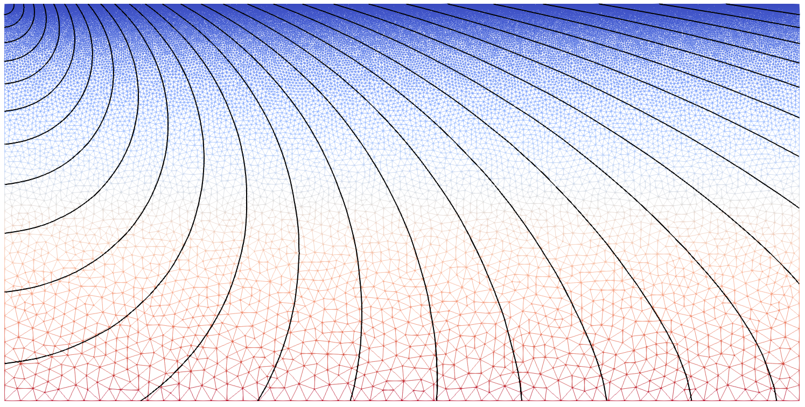

# Velocity-gradient example

This example demonstrates a complete Fortran workflow for `trilat-time`. No
Python preprocessing is required:



The colored wireframe shows the velocity field and the increase in mesh-cell
size with depth. The black isolines show the computed traveltime field.

- `mesh_gradient.f90` uses the Gmsh Fortran API to generate a two-dimensional
  triangular mesh with a vertical velocity gradient. It writes the mesh,
  cellwise velocity, and analytical traveltime to `input.vtk`.
- `gradient.f90` reads `input.vtk`, computes first-arrival traveltimes with
  `trilat-time`, compares them with the analytical solution, and writes
  `result.vtk`.

The source is located at the first mesh node, and the solver runs in fast mode
without diffraction loops.

## Build

The example requires GNU Make, a Fortran compiler (GFortran by default), and
the Gmsh shared library. The included `gmsh.f90` binding is for Gmsh 4.15.2.

From this directory, set the path to the Gmsh SDK library if it differs from
the default in the `Makefile`, then build both programs:

```bash
make GMSH_LIB_DIR=/path/to/gmsh-sdk/lib
```

This creates:

- `mesh_gradient`, the mesh and model generator;
- `gradient`, the traveltime solver.

Compiler and optimization flags can also be overridden, for example:

```bash
make FC=gfortran FFLAGS="-O2 -Wall" \
  GMSH_LIB_DIR=/path/to/gmsh-sdk/lib
```

## Run

Generate the input model first, then compute the traveltimes:

```bash
./mesh_gradient
./gradient
```

The first command writes `input.vtk`. The second writes `result.vtk`, containing
the velocity, computed and analytical traveltimes, and relative error. Both
files can be inspected with ParaView.

To remove the executables and intermediate build files:

```bash
make clean
```
