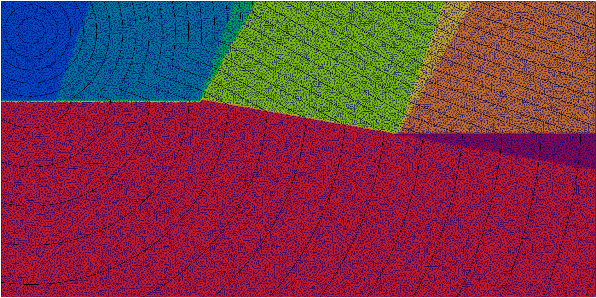
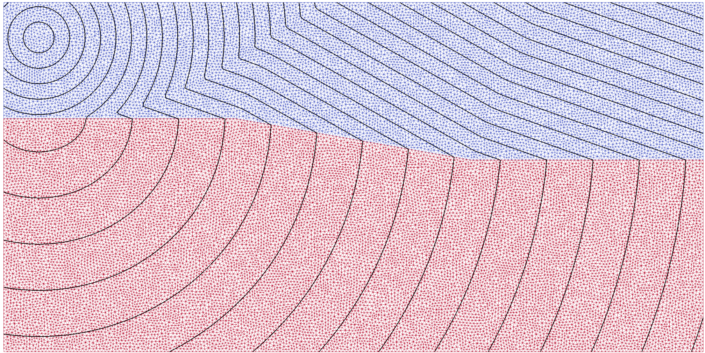

# The Ramp Example

<p align="center">
  
  
</p>

The left image shows the expected propagation domains, each one represented with a different color.  
The right image shows the computed traveltime isolines on top of a colored wireframe representation of the velocity model.

## Purpose

This example illustrates one of the main motivations behind `trilat-time`:
handling first-arrival propagation on conformal triangular meshes when velocity interfaces are not aligned with Cartesian grids.

The model contains a ramp-shaped interface separating two velocity layers.
This geometry generates several interacting propagation modes:

- direct arrivals,
- refracted arrivals,
- conic/head-wave propagation,
- and localized diffraction effects at the ramp corners.

The example is designed as a controlled validation case for the hybrid local operators implemented in `time.f90`. In particular, it demonstrates:

- propagation on an unstructured triangular mesh,
- interaction between edge, face, planar and conic operators,
- explicit diffraction reloop strategies,
- and the influence of mesh geometry on the partition between propagation domains.

The diffraction points are prescribed explicitly in order to evaluate how secondary-source reloop strategies improve the first-arrival solution near geometric discontinuities.

Unlike Cartesian-grid solvers, the objective here is not to optimize performance on planar interfaces, but to maintain stable and physically consistent traveltime estimates when the geometry is not naturally aligned with orthogonal grids.

## Model Layout

The domain is a `10000 m x 5000 m` rectangle discretized with a conformal triangular mesh.

- Upper layer velocity: `1000 m/s`
- Lower layer velocity: `3000 m/s`
- Source position: `(500, 500)`
- First diffraction point `D1`: `(3333.3, 1666.7)`
- Second diffraction point `D2`: `(6666.7, 2254.42)`

The ramped interface generates several interacting propagation domains whose boundaries depend both on the physical velocity contrast and on the local mesh sampling. In the simplest reading, we expect:

- a direct-arrival domain near the source,
- a domain controlled by the first diffraction point `D1`,
- a transition domain influenced by the ramp segment,
- a domain controlled by the second diffraction point `D2`,
- deeper/lower domains influenced by the velocity contrast.

The exact zone map used for the reference solution is stored in the input VTK file as `branch_id`.

## Generate the Input VTK

The input mesh, the cellwise velocities, the branch map and the reference traveltime field are generated by the Python script [domain.py](/home/herrero/Atelier/mesh/trilat-time/examples/fortran/ramp/domain.py:1).

From this directory, run:

```bash
python3 domain.py
```

This writes:

```text
input_velocity_complex_branch_id.vtk
```

## Run the Fortran Example

From this directory:

```bash
make
./ramp
```

The program writes:

```text
result.vtk
```

## What `ramp.f90` Does

The program [ramp.f90](/home/herrero/Atelier/mesh/trilat-time/examples/fortran/ramp/ramp.f90:1) follows a compact sequence:

1. Load the mesh, velocity, theoretical traveltime and branch map from the generated VTK file.
2. Locate the source node from its coordinates.
3. Activate the slow diffraction mode with `adiff%fast = .false.`.
4. Define the two diffraction nodes `D1` and `D2` explicitly.
5. Initialize the nodal traveltime field with the source time equal to zero.
6. Run `timeonevsall2d`.
7. Compare the computed traveltime against the reference field.
8. Dump the model and the results to `result.vtk`.

## Output Fields and visualization

The output file `result.vtk` is written in ASCII VTK format and can be inspected with [ParaView](https://www.paraview.org/). It contains:

- `velocity`: cellwise velocity model,
- `time`: computed traveltime,
- `theo_time`: reference traveltime loaded from the Python-generated VTK,
- `error_time`: relative error in percent,
- `branch_id`: domain/zone identifier used to build the reference solution.

## Mesh Resolution Experiments

One of the strengths of `trilat-time` is its relative stability on conformal triangular meshes.

Users are encouraged to experiment with the mesh resolution by modifying the parameter:

```python
mesh_size = 50.0
```

inside `domain.py`.

For example:

```python
mesh_size = 100.0
mesh_size = 50.0
mesh_size = 25.0
```

and then regenerating the input model:

```bash
python3 domain.py
```

This allows direct observation of how the traveltime field and numerical errors evolve with mesh refinement.

Unlike Cartesian-grid solvers, the triangular mesh naturally conforms to the velocity interface geometry. The remaining errors are therefore controlled mainly by the local operator stencil and the mesh sampling near propagation-domain transitions. Moreover, the operators are not based on finite-difference schemes, and the dedicated conic operator allows robust traveltime estimations even when relatively large mesh cells are used.

## Notes

- This example is meant as a demonstration and validation case, not as a production benchmark.
- The diffraction points are prescribed explicitly in the Fortran code.
- The Python preprocessing script is part of the example logic: it generates both the geometry and the reference fields used for comparison.
