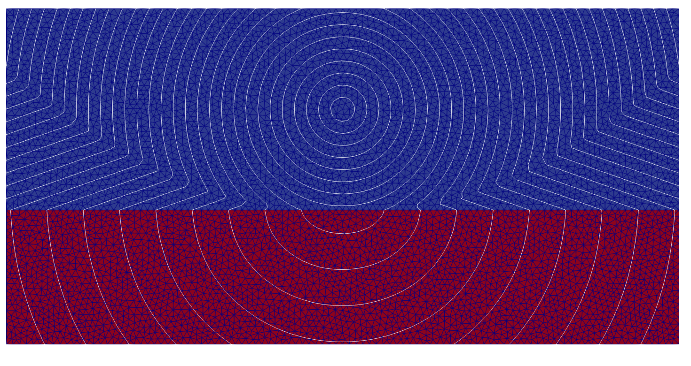

# Two-layer example

This example is a **didactical introduction** to the Fortran workflow of
Trilat-time. A Python helper first constructs the mesh and physical model; the
Fortran program then computes first-arrival traveltimes, exports the result,
and makes it possible to visualize the wavefronts.



The figure shows a source located in the upper layer, a horizontal interface
separating two constant-velocity media, and the resulting first-arrival field.
The upper layer is slower than the lower layer, so the solution contains direct,
refracted, and head-wave arrivals. The Python helper writes an ASCII VTK file
containing the mesh, cellwise velocity, and an analytical traveltime field used
for comparison.

---

## Purpose of this example

This example illustrates a complete preprocessing and solver workflow:

1. construct a conformal triangular mesh with Python and the Gmsh API,
2. assign a velocity to each triangular cell,
3. compute an analytical reference traveltime at each node,
4. write the model to `input_velocity.vtk`,
5. load the model and define the source in Fortran,
6. compute the numerical traveltime field,
7. compare it with the reference solution,
8. write the results to `result.vtk`.

Python is used only to prepare the input model. Traveltime propagation is
performed by the Fortran solver.

---

## Files included with the example

* `create_two_layers.py`: Python helper that constructs the mesh and writes the
  input model
* `two_layers.f90`: main Fortran program
* `Makefile`: build instructions for the Fortran program
* `input_velocity.vtk`: generated mesh, cellwise velocity, and analytical
  traveltime field
* `two_layers.png`: illustration of the model and computed wavefronts

---

## Generate the input model with Python

The helper requires Python 3, NumPy, and the Gmsh Python API. From this
directory, run:

```bash
python3 create_two_layers.py
```

The script creates a `10000 m x 5000 m` rectangular domain divided by a
horizontal interface at `3000 m`. It uses two Gmsh plane surfaces so that the
triangular mesh conforms to the interface: no triangle crosses from one
velocity layer into the other. The source at `(5000 m, 1500 m)` is embedded as
a mesh node.

The upper and lower layers have velocities of `1000 m/s` and `3000 m/s`,
respectively. The script also evaluates the analytical two-layer solution at
each node, including direct, refracted, and head-wave branches. It writes all
of this information to `input_velocity.vtk`:

* point coordinates and triangular connectivity,
* cell data named `velocity`,
* point data named `time`, containing the analytical reference solution.

The domain dimensions, interface depth, source position, and target mesh size
can be changed in the `main()` function of `create_two_layers.py`. If the layer
velocities are changed, update both the mesh velocity assignments in
`build_two_layer_conformal()` and the analytical velocities in `main()` so that
the model and reference solution remain consistent.

## Build and run the Fortran solver

Compile the example with:

```bash
make
```

Then run:

```bash
./two_layers
```

The program writes the numerical traveltime, analytical traveltime, and
relative error to `result.vtk`.

### Generated output

`result.vtk` is the final output of the example. It is generated when
`./two_layers` runs, is excluded by the repository `.gitignore`, and is not
part of the distributed example files. Regenerate it whenever you run the
solver.

---

## Fortran solver walkthrough

### 1. Build the physical setup

The program starts by activating the fast mode for diffraction:

```fortran
adiff%fast = .true.
```

In this example diffraction is not used, so the diffraction structure only serves to tell the solver to perform a single fast pass. In the solver, `adiff%fast = .true.` exits after the first traveltime computation rather than performing secondary diffraction loops.

### 2. Load the model

The call

```fortran
call load_model(amesh, velocity, theo_time)
```

reads the input VTK file and fills three objects:

* `amesh` : the triangular mesh,
* `velocity` : the velocity value for each cell,
* `theo_time` : the theoretical first-arrival time at each node.

For this example, the mesh-loading details are not the main point. What matters is that after this call the program has a complete mesh and a cellwise velocity model ready for the solver.

### 3. Choose the source node

The source is prescribed by its node index:

```fortran
k = 7
```

The comments in the program indicate that this corresponds to a source at `(5000,1500)` in the upper layer. Since the code is written in Fortran, indexing is **1-based**.

### 4. Initialize the traveltime problem

The example then calls:

```fortran
call pre_timeonevsall2d_onvertex(amesh, k, traveltime, nton)
```

This helper routine performs two key operations:

* it allocates and initializes the traveltime array,
* it constructs the node-to-node connectivity structure `nton`.

Inside `pre_timeonevsall2d_onvertex`, the traveltime array is initialized to `infinity` everywhere and set to zero at the source node `k`. The same routine also allocates `nton` and computes it with `compnton`. This is exactly the standard initialization path for a source located on a mesh vertex. The helper is defined in `time.f90`, where it allocates `time` and `nton`, calls `compnton`, initializes `time` to `infinity`, and sets `time(k)=0`.

### 5. Compute the traveltime field

The core computation is performed by:

```fortran
call timeonevsall2d(amesh, velocity, traveltime, nton, adiff)
```

This is the main solver entry point. It takes the mesh, the cellwise velocity, the initialized nodal traveltime array, the precomputed node-to-node connectivity, and the diffraction control structure. In the source code, `timeonevsall2d` is documented as the routine that computes the first-arrival field from all nodes already carrying a finite initial time.

Internally, the solver propagates time through the triangular mesh using several local operators and updates the nodal first-arrival field until no better estimate is found.

### 6. Free the connectivity structure

After the solver call, it is safer to release the `nton` structure explicitly:

```fortran
call free_nton(nton)
```

This step is important because `nton` is built from pointer-allocated linked lists. These internal list nodes are **not** released automatically when the array goes out of scope. The dedicated cleanup routine `free_nton` is provided in `LAT_mesh.f90` exactly for this reason.

For clarity, the central part of the example should therefore be:

```fortran
call cpu_time(start_time)
call pre_timeonevsall2d_onvertex(amesh, k, traveltime, nton)
call timeonevsall2d(amesh, velocity, traveltime, nton, adiff)
call free_nton(nton)
call cpu_time(finish_time)
```

### 7. Export and visualize the result

After the traveltime field is computed, the program writes `result.vtk`. The
generated file contains:

- mesh geometry,
- cellwise velocity,
- numerical traveltime,
- analytical traveltime,
- relative error.

You can inspect the result using **ParaView**:

1. Open `result.vtk` in ParaView
2. Apply a color map to the `time` field
3. Add contour filters to visualize wavefronts
4. Optionally overlay the mesh to inspect resolution and interface geometry

This is the recommended way to explore and validate the computed traveltime field.
---

## What this example teaches

This example is the reference starting point if you want to understand the Fortran usage of Trilat-time.

It shows the essential solver pattern:

```fortran
call load_model(...)
call pre_timeonevsall2d_onvertex(...)
call timeonevsall2d(...)
call free_nton(...)
```

Once this sequence is clear, more advanced examples mainly differ by:

* how the mesh is built,
* how the initial condition is prescribed,
* whether diffraction is used,
* how the outputs are post-processed.

---

## Notes

* This example uses a **source on a mesh node**.
* It uses **fast mode** (`adiff%fast = .true.`), so no secondary diffraction loop is performed.
* The theoretical reference field generated by `create_two_layers.py` is read
  from the input VTK file and used only for validation.
* The mesh-loading routine is intentionally not the focus here; it is just a convenient way to provide a ready-to-run didactical case.
* Python constructs the input model; it is not used during traveltime
  propagation.
